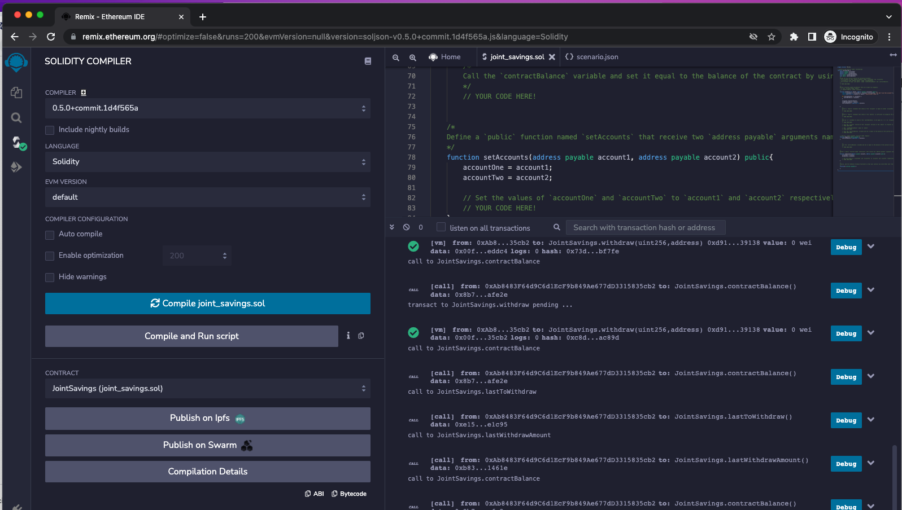
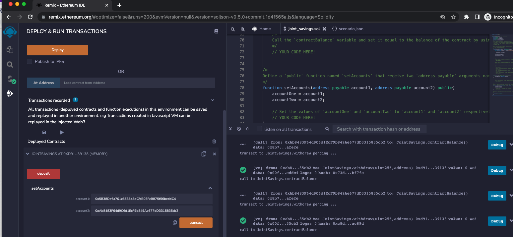
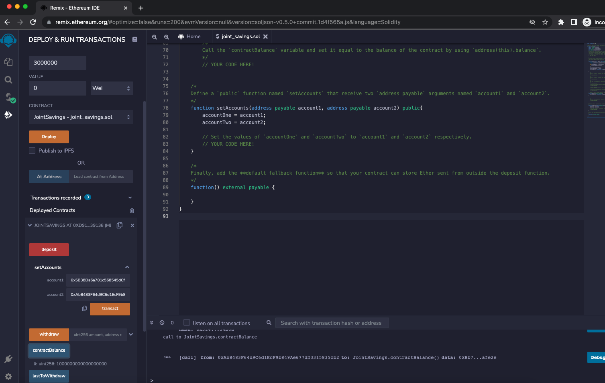
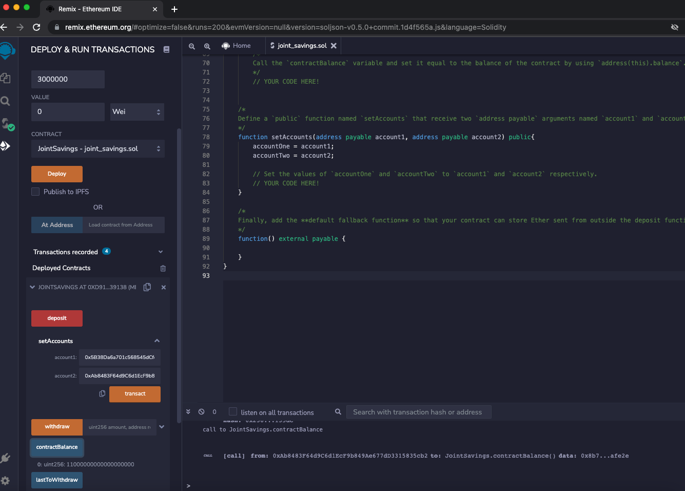
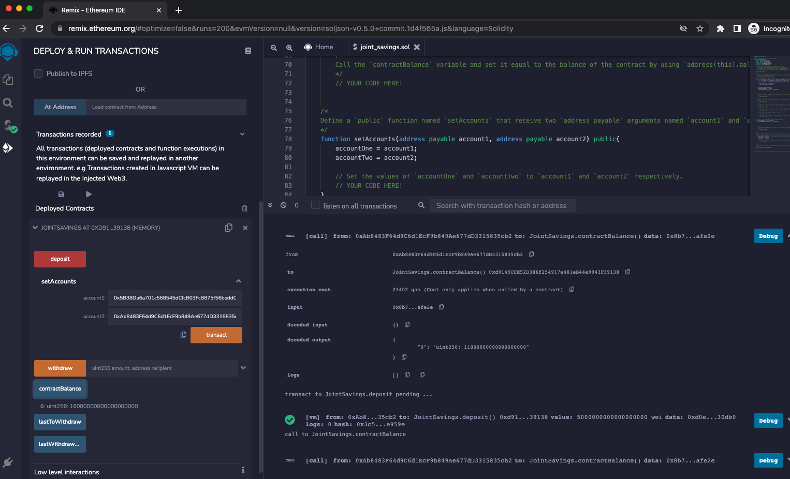
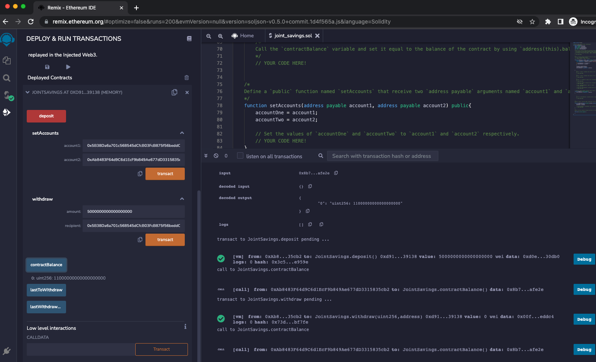
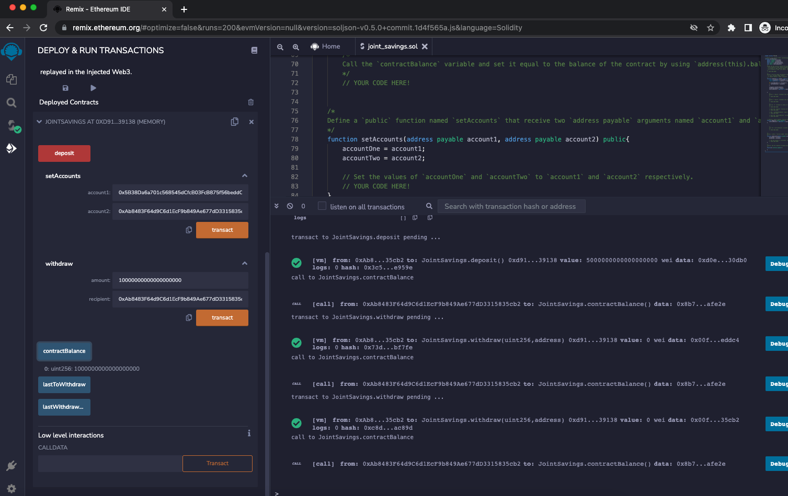
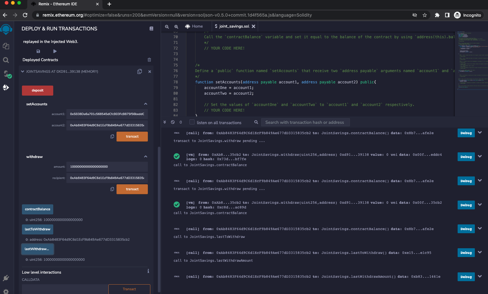
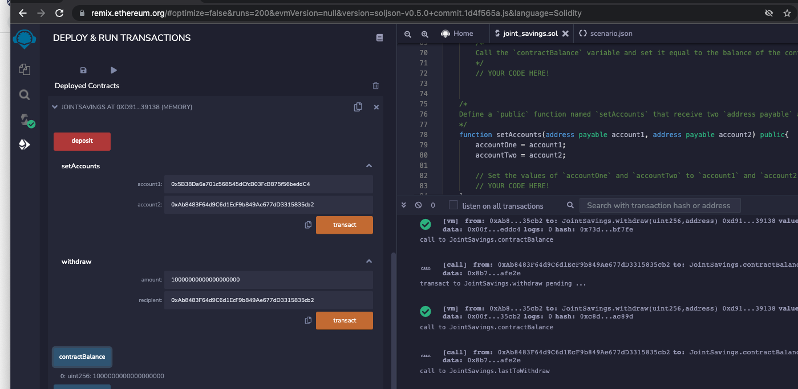

# Challenge20
## Overview
This challenge asks to build a smart contract in solidity using Remix IDE. The smart contract consists of a joint savings account that can receive deposits and make withdrawals using two required set accounts.

## The Results

The instructions ask to assign the contract's variables and finish coding the functions provided in the starter code file. After this, the contract is compiled, deployed, accounts are set, and tested for functionality. Here are screenshots of the aforementioned:

Contract compiled and deployed:

Set Accounts: Contract will only deposit and withdraw from these two set accounts

Transaction 1: Send 1 ether as wei

Transaction 2: Send 10 ether as wei

Transaction 3: Send 5 ether

Withraw 1: 5 ether into accountOne

Withdraw 2: 10 ether into accountTwo

lastToWithdraw and lastToWithdrawAmount

contractBalance

## Summary
The joint savings smart contract account was successfully coded, setup, and functions with the two setaccounts as intended.